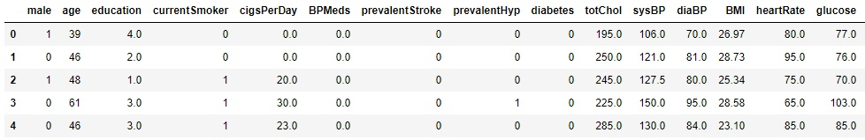

# Framingham Case Study
<p align="center">

</p>
The Framingham Heart Study was started in 1948 under the direction of the National Heart Institute (now known as the National Heart, Lung, and Blood Institute). The initial study recruited 5,209 men and women between 30 and 62 years of age. Researchers asked participants questions about their general health, medications and asked about illnesses, including cancer.<br />
Patients were given a questionnaire and exam every 2 years and were asked to write down:<br />
• Physical characteristics<br />
• Behavioral characteristics<br />
• Test results<br />

## Objective
Framingham case study aims to predict whether or not a patient has a risk of coronary heart disease within a span of 10 years. 

## Dataset description
The dataset is a small subset of possible FHS dataset, having 4240 observations and 16 variables. <br /> 
The dataset was obtained from https://courses.edx.org/asset-v1:MITx+15.071x_2a+2T2015+type@asset+block/framingham.csv  <br />
More information about the data set used in this study can be found at: https://biolincc.nhlbi.nih.gov/static/studies/teaching/framdoc.pdf

We will investigate risk factors collected in the first data collection for the study:.
  
* Demographic risk factors
    * __male__: Gender of patient. The variable is a binary named “male” in the dataset.
    * __age__: age in years at first examination
    * __education__: A categorical variable of the participants education, with the levels: Some high school (1), high school/GED (2), college/vocational school (3), college (4)

* Behavioral risk factors
    * __currentSmoker__, __cigsPerDay__: Smoking behavior

* Medical history risk factors
    * __BPmeds__: On blood pressure medication at time of first examination
    * __prevalentStroke__: Previously had a stroke (0 = free of disease)
    * __prevalentHyp__: Currently hypertensive
    * __diabetes__: Currently has diabetes

* Risk factors from first examination
    * __totChol__: Total cholesterol (mg/dL)
    * __sysBP__: Systolic blood pressure
    * __diaBP__: Diastolic blood pressure
    * __BMI__: Body Mass Index, weight (kg)/height (m) 2
    * __heartRate__: Heart rate (beats/minute)
    * __glucose__: Blood glucose level (mg/dL)
    * __TenYearCHD__ : The 10 year risk of coronary heart disease(CHD).
    


More information about the data set used in the study can be found at: https://biolincc.nhlbi.nih.gov/static/studies/teaching/framdoc.pdf

## Tools required

- [Python](https://www.python.org/). Python 3 is the best option.
- [IPython and the Jupyter Notebook](http://ipython.org/). (FKA IPython and IPython Notebook.)
- Some scientific computing packages:
	- numpy
	- pandas
	- scikit-learn
	- matplotlib
  
## Installation of Python and packages

Install Python 3 and all of these packages in a few clicks with the [Anaconda Python distribution](https://www.continuum.io/downloads). 

Anaconda is very popular amongst Data Science and Machine Learning communities.

The scientific computing packeges used in this project are:

1. numpy
2. pandas
3. scikit-learn
4. seaborn
5. matplotlib

## The Analytical Approach

### Data loading

Read the dataset framingham
```{r load_data}
framingham = pd.read_csv('framingham.csv')
# print the first 5 rows of data
framingham.head()
```



