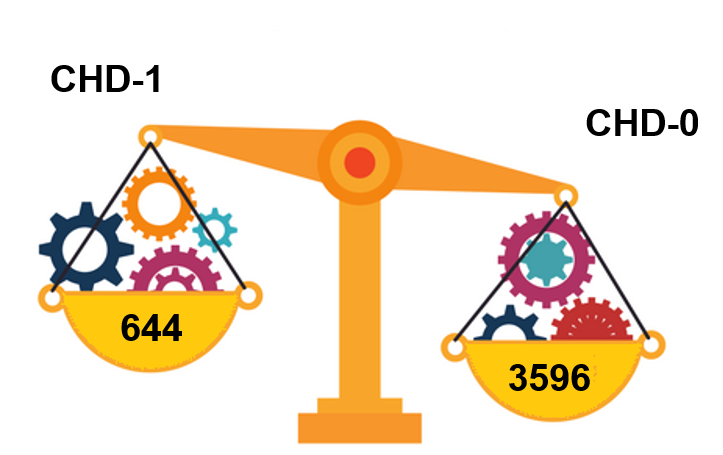

# Framingham Case Study
<p align="center">

</p>
The Framingham Heart Study was started in 1948 under the direction of the National Heart Institute. The initial study recruited 5,209 men and women between 30 and 62 years of age. Researchers asked participants questions about their general health, medications and asked about illnesses, including cancer.<br />
Patients were given a questionnaire and exam every 2 years and were asked to write down:<br />
• Physical characteristics<br />
• Behavioral characteristics<br />
• Test results<br />

## Objective
Framingham case study aims to predict whether or not a patient has a risk of coronary heart disease within a span of 10 years. 

## Dataset description
The dataset is a small subset of possible FHS dataset, having 4240 observations and 16 variables. The dataset was obtained from https://courses.edx.org/asset-v1:MITx+15.071x_2a+2T2015+type@asset+block/framingham.csv


We will investigate risk factors collected in the data collection for the study:.
  
* Demographic risk factors
    * __male__: Gender of patient. The variable is a binary named “male” in the dataset.
    * __age__: age in years at first examination
    * __education__: A categorical variable of the participants education, with the levels: Some high school (1), high school/GED (2), college/vocational school (3), college (4)

* Behavioral risk factors
    * __currentSmoker__, __cigsPerDay__: Smoking behavior

* Medical history risk factors
    * __BPmeds__: On blood pressure medication at time of first examination
    * __prevalentStroke__: Previously had a stroke (0 = free of disease)
    * __prevalentHyp__: Currently hypertensive
    * __diabetes__: Currently has diabetes

* Risk factors from first examination
    * __totChol__: Total cholesterol (mg/dL)
    * __sysBP__: Systolic blood pressure
    * __diaBP__: Diastolic blood pressure
    * __BMI__: Body Mass Index, weight (kg)/height (m) 2
    * __heartRate__: Heart rate (beats/minute)
    * __glucose__: Blood glucose level (mg/dL)
    * __TenYearCHD__ : The 10 year risk of coronary heart disease(CHD).
    


More information about the data set used in the study can be found at: https://biolincc.nhlbi.nih.gov/static/studies/teaching/framdoc.pdf

## Tools required

- [Python](https://www.python.org/). Python 3 is the best option.
- [IPython and the Jupyter Notebook](http://ipython.org/). (FKA IPython and IPython Notebook.)
- Some scientific computing packages:
	- numpy
	- pandas
	- scikit-learn
	- matplotlib
  
## Installation of Python and packages

Install Python 3 and all of these packages in a few clicks with the [Anaconda Python distribution](https://www.continuum.io/downloads). 

Anaconda is very popular amongst Data Science and Machine Learning communities.

The scientific computing packeges used in this project are:

1. numpy
2. pandas
3. scikit-learn
4. seaborn
5. matplotlib

## The Analytical Approach

### Data Loading

Read the dataset framingham
```{r load_data}
framingham = pd.read_csv('framingham.csv')
# print the first 5 rows of data
framingham.head()
```


On futher inspection of the data we make two observations about the dataset:

* All columns contain data that lies in the usual range of values of each of the medical tests employed.
* There are a few missing values in the data which have to be dealt with.

### Data Cleaning

#### Steps:

* Count the number of null values present in each column.


* All columns are having less than 10% of missing values and thus they can be filled in with appropriate values using the following user defined function:

```{python impute function}
def impute_median(series):
    return series.fillna(series.median())
```
* Few of the columns like BMI and cigsPerDay can be filled in using groupby by comparing values in columns directly related to them.

This can be illustrated using a correlation plot. From this plot we can understand how some of the columns are correlated to each other thus using them in filling the missing values.


This helps in making a more informed guess about the missing values.

```{python impute function}
by_currentSmoker_class=framingham.groupby(['currentSmoker'])
framingham.cigsPerDay=by_currentSmoker_class['cigsPerDay'].transform(impute_median)
by_age_class=framingham.groupby(['age','male','diabetes'])
framingham.BMI=by_age_class['BMI'].transform(impute_median)
```
### Data Visualization

Let's dig into deep into the dataset through visualization conducted using packges seaborn and matplolib.

#### Let us understand the age distribution of patients in the dataset

```{python visualize}
sns.distplot(framingham['age'], bins=15, kde=True)
plt.ylabel('Count')
plt.title('Agewise distribution of the patients')
```
<p align="center">

</p>
####  How does 10-year risk of Coronary Heart Disease affect patients age wise and gender wise?

```{python visualize}
mx = sns.factorplot(x="AgeType",y='TenYearCHD', hue='PersonType',data=framingham, kind="bar", size=6)
mx.set(ylabel='Percentage of patients at a risk of having CHD after ten years')
plt.title('Ten year CHD risk by age type');
```

<p align="center">

</p>

It is immediately evident that male patients over the age of 60 have a higher risk of developing cardiac disease in the next ten years as compared to other age groups. Doctors can thus prescribe appropriate exercise regimen or medications to the patients which will help prevent its sudden occurence.

#### How does prevalent stroke and diabetes affect the chances of CHD?

```{python visualize}
sns.barplot('prevalentStroke','diabetes', data=framingham,  hue="PersonType")
```
<p align="center">

</p>

We can observe that females have a higher cardiac risk when they are already diagonosed with stroke and diabetes whereas males have comparitively lower risks.

#### How does systolic blood pressure affect the chances of CHD?

```{python visualize}
plt.figure(figsize=(10,5))
sns.boxplot('AgeType','sysBP', data=framingham, hue="TenYearCHD")
plt.title('Scatterplot of systolic blood pressure vs age type coloured by people who are at risk of CHD')
```
<p align="center">

</p>
We can observe that as systolic blood pressure increases for each age group there is higher chance for CHD to develop after 10 years.

### Model Training and Evaluation

Analyze the number of observations in the dataset that belog to each category as either having a risk of develping CHD or not.
<p align="center">

</p>
This is a highly imbalanced dataset with only roughly 15% of the observations lying in the category of having a high risk of contracting a cardiac disease.


#### Steps:

* Split data into train and test set.

```{python model}
X = framingham.drop(['TenYearCHD','education'],axis=1)
y = framingham.TenYearCHD
X_train, X_test, y_train, y_test = train_test_split(X,y,random_state=23)
```
* Train the algorithm on training data. 

```{python model}
logreg = LogisticRegression(C=0.8)
logreg.fit(X_train, y_train)
```
* Evaluate trained model on unknown test data to understand model performance.

```{python model}
# make class predictions for the testing set
y_pred_class = logreg.predict(X_test)
# calculate accuracy with threshold of 0.5
print(metrics.accuracy_score(y_test, y_pred_class))
```
The model accuracy on test data is 85.8%. 

Due to an imbalanced dataset, let's compare with our baseline model 

```{python model}
# calculate null accuracy 
y_test.value_counts().head(1) / len(y_test)
```
The null accuracy is 85.6%. There is only a slight improvement in accuracy for our model from the baseline model.

Accuracy is not an appropriate metric in this scenario. We employ ROC curve to further understand performance of our model on test data.
Let us retrain our data using logistic regression this time using a parameter called 'balanced' which would handle imbalance in the data by changing the threshold set by logistic regression model:

* Retrain the algorithm on training data. 

```{python model}
logreg = LogisticRegression(class_weight='balanced')
logreg.fit(X_train, y_train)
# make class predictions for the testing set
y_pred_class = logreg.predict(X_test)
```
#### Compare confusion matrix between imbalanced vs balanced data

Our aim is to be able to detect the risk of heart disease more precisely even if we have to compromise on the false positives. It is very crucial to reduce the false negatives as a person's health is jeopardised once he is wrongly identified as healthy when in actual he is sick. 

  

#### Compare between ROC curve of predicted probabilities of imbalanced vs balanced data

  
<p align="left">
  
</p>

Now the model has drastically improved through a balanced Logistic regression model in capturing patients that were not being detected earlier as having a high risk for coronary heart disease in a span of 10 years. 

## Future Scope

The Framingham case study provides a foundation for research into clinical case studies related to occurence of heart disease which claims millions of lives every year. Machine learning models helps doctors identify patients who have chances of contracting one. This technique can be replicated for prevention of various other diseases thus savinga lot of lives. 


